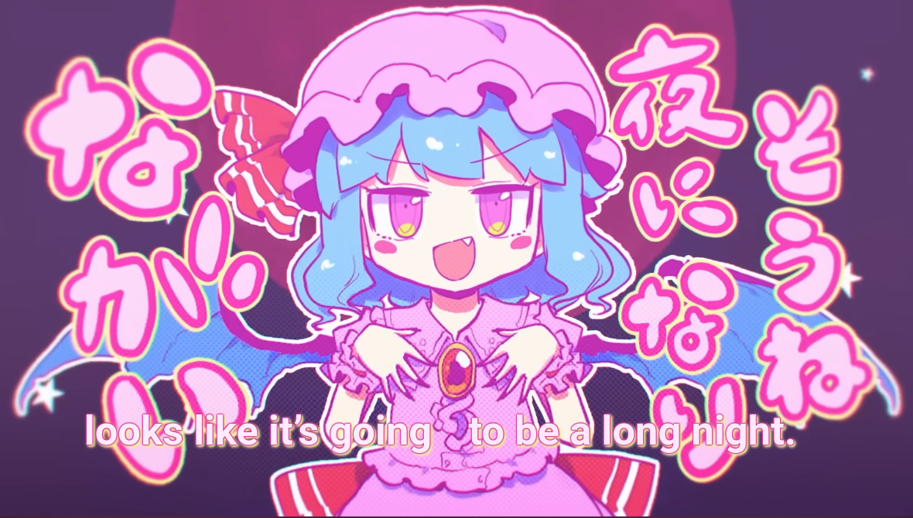
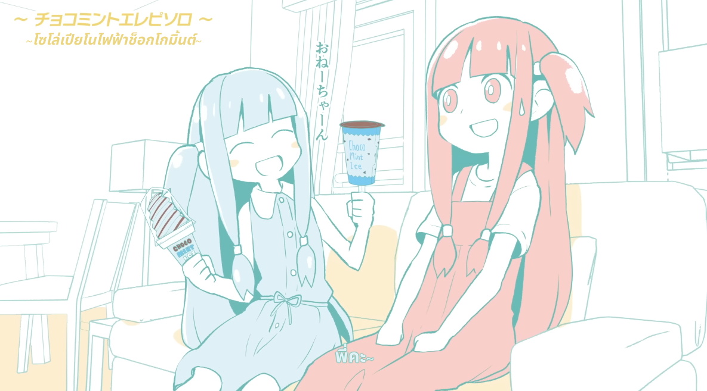
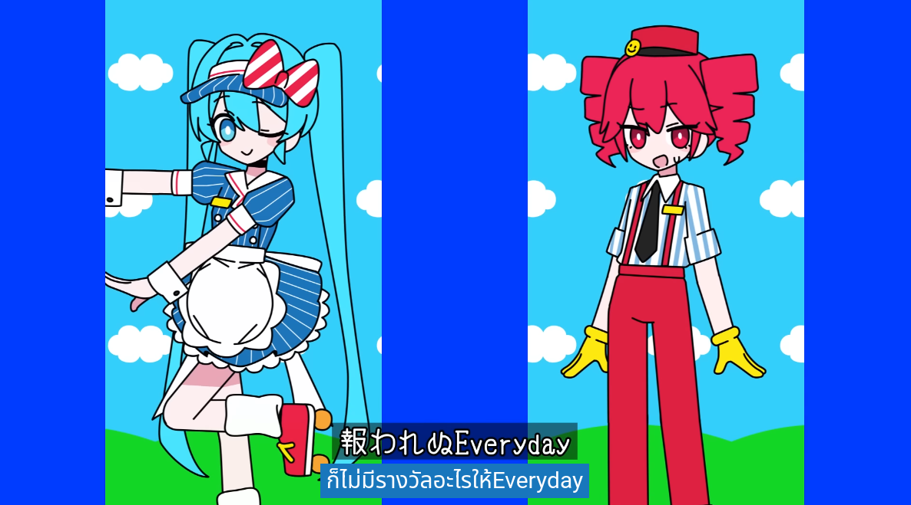

# ytsub-rs

A collection of Rust utilities and crates for working with YouTube styled subtitles, an attempt to rewrite the
[YTSubConverter](https://github.com/arcusmaximus/YTSubConverter) in Rust.

While the official YouTube subtitle editor lets you edit timed text, it actually does *not* support
the full range of features that the proprietary YouTube subtitle format supports. This project aims to provide
a more complete solution for working with YouTube subtitles.

## The SRV3 (YouTube Timed Text) Format

SRV3 is a proprietary format used by YouTube for storing subtitles. It is based on the [TTML](https://www.w3.org/TR/ttml1/) standard, but with slight
modifications. The format is XML based, and is used to store subtitles for YouTube videos. The format however does not only support timed text, but also
a range of other features such as:

- Text formatting (bold, italic, underline, strikethrough)
- Text color and background transparency
- Custom text alignment
- 6 different font styles
    - Carrois Gothic SC
    - Comic Sans MS
    - Courier New
    - Lucida Console
    - Monotype Corsiva
    - Roboto
    - Times New Roman
- Custom font sizes and colors
- Outlines, glows and drop shadows
- Custom text rotation
- Karaoke timing
- Vertical text
- Ruby (furigana) text

The usage of this format is popular among fansubbers and captioners especially in Japanese media and anime, as it allows for a wide range of text formatting options
that can emulate and even overlay original text in a video. You will usually see these kinds of styled subtitles in
fansubbed anime, Japanese music videos, or VTuber clips on YouTube.

This makes the SRV3 format similar to Advanced Substation Alpha instead of the more common SubRip or WebVTT formats in terms of features.

### Example videos showcasing the capabilities of the SRV3 format

- [PinocchioP - Anonymous M](https://youtu.be/yiqEEL7ac6M) (`Thai - animation` caption track)
- [Shinra-bansho - Aria on the line of fate MV](https://youtu.be/AYpVrYFg5uo)
  
- [Kizuna AI - AIAIAI MV](https://youtu.be/S8dmq5YIUoc)
- [ZUTOMAYO - Fastening MV](https://youtu.be/COll6PdtI5w)
- [GYARI, Kotonoha Akane & Aoi - Aoi-chan is going to eat ChocoMint no matter what](https://youtu.be/pfkBYHFZAt8) (Non-English example since the English version has been automatically unformatted due to YouTube's subtitle editor being used)
  
- [32ki, Hatsune Miku & Kasane Teto - Mesmerizer](https://youtu.be/19y8YTbvri8) (Thai captions only)
  
- [x0o0x - Kisaragi Station](https://youtu.be/UxM5UgpXYM4) (Use British English subtitles for the styled version)
- [Kikuo ft. Hatsune Miku - Love me, Love me, Love me](https://youtu.be/NTrm_idbhUk)
- Most, if not all hololive music videos are officially subtitled in this format, with karaoke timing and custom text formatting
- Various news clips from American news networks which provide real-time captioning with a teletype effect [like this](https://youtu.be/FVeoC9pm5rI)
- Various VTuber clips, example [here](https://youtu.be/u_lcDl6qnh4)
